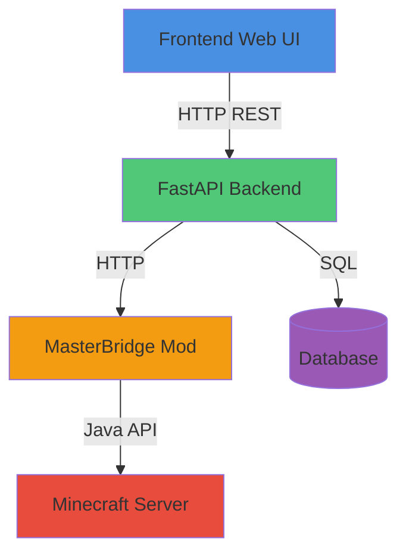

# 📋 MasterBridge API - Documentación Completa

## 📖 Índice
1. [Descripción General](#descripción-general)
2. [Arquitectura del Sistema](#arquitectura-del-sistema)
3. [Endpoints del Mod](#endpoints-del-mod)
4. [Arquitectura Backend Python](#arquitectura-backend-python)
5. [API REST del Backend](#api-rest-del-backend)
6. [Configuración](#configuración)
7. [Ejemplos de Uso](#ejemplos-de-uso)

---

## 📌 Descripción General

**MasterBridge** es un mod de Minecraft Fabric que expone una API HTTP para control remoto del servidor. El sistema completo incluye:

- **Mod de Fabric (Java)**: Expone endpoints HTTP en `localhost:8081`
- **Backend Python**: Aplicación FastAPI que actúa como proxy y controlador
- **Frontend Web**: Interfaz de usuario para gestión del servidor

### Flujo de Datos
```
Frontend → Backend FastAPI → MasterBridge Mod → Minecraft Server
```

---

## 🏗️ Arquitectura del Sistema

### Componentes Principales



### Capas de la Arquitectura Python

| Capa | Archivo | Responsabilidad |
|------|---------|----------------|
| **Rutas** | `routes/servers.py` | Endpoints HTTP REST |
| **Controlador** | `app/controllers/server_controller.py` | Lógica de negocio |
| **Servicio** | `app/services/minecraft/service.py` | Gestión de procesos |
| **Cliente API** | `app/services/minecraft/masterbridge_client.py` | Cliente HTTP para MasterBridge |
| **Proceso** | `app/services/minecraft/process.py` | Control del servidor Minecraft |

---

## 🎯 Endpoints del Mod MasterBridge

> **Puerto por defecto**: `8081`  
> **Host**: `127.0.0.1` (localhost)  
> **CORS**: Habilitado para todos los orígenes

### ✅ Resumen de Endpoints

| Método | Endpoint | Descripción |
|--------|----------|-------------|
| **GET** | `/api/full-state` | Estado completo del servidor |
| **GET** | `/api/server-status` | Estado detallado del servidor |
| **GET** | `/api/online-players` | Lista detallada de jugadores |
| **GET** | `/api/chat-log` | Historial de mensajes de chat |
| **GET** | `/api/active-events` | Eventos activos actualmente |
| **GET** | `/pack.zip` | Descargar resource pack |
| **POST** | `/api/send` | Enviar mensajes de chat |
| **POST** | `/api/kick` | Expulsar jugador |
| **POST** | `/api/ban` | Banear jugador |
| **POST** | `/api/unban` | Remover ban |
| **POST** | `/api/events` | Activar eventos de caos |
| **POST** | `/api/cinematics` | Activar cinemáticas |
| **POST** | `/api/paranoia` | Activar sistema de paranoia |
| **POST** | `/api/special-events` | Activar eventos especiales |

---

### 💬 Chat & Mensajería

#### POST `/api/send`
Enviar mensajes de chat al servidor Minecraft.

**Parámetros:**
```json
{
  "text": "Mensaje a enviar (requerido)",
  "sender": "Admin (opcional, default: 'Admin')"
}
```

**Respuesta:**
```json
{
  "status": "ok"
}
```

**Ejemplo:**
```bash
curl -X POST http://127.0.0.1:8081/api/send \
  -H "Content-Type: application/json" \
  -d '{"text": "¡Hola jugadores!", "sender": "Admin"}'
```

---

#### GET `/api/chat-log`
Obtener historial completo de mensajes de chat.

**Respuesta:**
```json
[
  {
    "user": "Steve",
    "text": "Hola a todos",
    "time": "2026-01-07T12:00:00Z"
  },
  {
    "user": "Alex",
    "text": "¿Alguien quiere jugar?",
    "time": "2026-01-07T12:01:00Z"
  }
]
```

---

### 👥 Jugadores

#### GET `/api/online-players`
Lista detallada de todos los jugadores conectados.

**Respuesta:**
```json
[
  {
    "name": "Steve",
    "uuid": "069a79f4-44e9-4726-a5be-fca90e38aaf5",
    "ping": 45,
    "health": 20.0,
    "food": 20,
    "level": 15,
    "dimension": "minecraft:overworld",
    "pos": {
      "x": 123.5,
      "y": 64.0,
      "z": -234.8
    }
  }
]
```

**Campos:**
- `name`: Nombre del jugador
- `uuid`: UUID único del jugador
- `ping`: Latencia en milisegundos
- `health`: Vida actual (0-20)
- `food`: Nivel de comida (0-20)
- `level`: Nivel de experiencia
- `dimension`: Dimensión actual (`overworld`, `nether`, `end`)
- `pos`: Posición en coordenadas XYZ

---

### 🎮 Moderación

#### POST `/api/kick`
Expulsar un jugador del servidor.

**Parámetros:**
```json
{
  "name": "NombreJugador (requerido)",
  "reason": "Razón del kick (opcional)"
}
```

**Respuesta:**
```json
{
  "status": "ok"
}
```

---

#### POST `/api/ban`
Banear un jugador permanentemente.

**Parámetros:**
```json
{
  "name": "NombreJugador (requerido)",
  "reason": "Razón del ban (opcional)"
}
```

**Respuesta:**
```json
{
  "status": "ok"
}
```

---

#### POST `/api/unban`
Remover ban de un jugador.

**Parámetros:**
```json
{
  "name": "NombreJugador (requerido)"
}
```

**Respuesta:**
```json
{
  "status": "ok"
}
```

---

### 🎬 Eventos & Cinemáticas

#### POST `/api/events`
Activar eventos de caos (delegado a `ChaosController`).

**Parámetros:**
```json
{
  "context_data": {
    "event_type": "chaos",
    "intensity": 3
  }
}
```

**Manejado por:** `ChaosController.handleEvent()`

---

#### POST `/api/cinematics`
Activar cinemáticas cinematográficas.

**Parámetros:**
```json
{
  "type": "invasion|apocalypse|wildanimals|meteor|darkness|chicken|anvil",
  "target": "all (opcional, default: 'all')",
  "difficulty": 1 (opcional, default: 1, rango: 1-5)
}
```

**Tipos de Cinemáticas:**
- `invasion`: Invasión de mobs hostiles
- `apocalypse`: Evento apocalíptico
- `wildanimals`: Ataque de animales salvajes
- `meteor`: Lluvia de meteoros
- `darkness`: Oscuridad total
- `chicken`: Invasión de pollos
- `anvil`: Lluvia de yunques

**Respuesta:**
```json
{
  "status": "Cinemática activada"
}
```

---

#### POST `/api/paranoia`
Activar sistema de paranoia en un jugador.

**Parámetros:**
```json
{
  "target": "NombreJugador (requerido)",
  "duration": 60 (opcional, default: 60 segundos)
}
```

**Efectos:**
- Sonidos aleatorios
- Efectos visuales
- Mensajes perturbadores

**Respuesta:**
```json
{
  "status": "Paranoia activada"
}
```

---

#### POST `/api/special-events`
Activar eventos especiales predefinidos.

**Parámetros:**
```json
{
  "type": "admin_coliseum (requerido)",
  "target": "NombreJugador (requerido)"
}
```

**Tipos de Eventos Especiales:**
- `admin_coliseum`: Arena de combate especial

**Respuesta:**
```json
{
  "status": "Evento especial activado"
}
```

---

### 📊 Estado del Servidor

#### GET `/api/server-status`
Estado detallado del servidor.

**Respuesta:**
```json
{
  "online_players": 5,
  "max_players": 20,
  "motd": "Un Servidor de Minecraft",
  "version": "1.20.1",
  "mspt": 12.5
}
```

**Campos:**
- `online_players`: Cantidad de jugadores conectados
- `max_players`: Máximo de jugadores permitidos
- `motd`: Mensaje del día
- `version`: Versión del servidor
- `mspt`: Tiempo promedio por tick en milisegundos

---

#### GET `/api/full-state`
Estado completo simplificado.

**Respuesta:**
```json
{
  "online_count": 5,
  "max_players": 20,
  "players": ["Steve", "Alex", "Notch", "Herobrine", "Jeb"]
}
```

---

#### GET `/api/active-events`
Obtener todos los eventos activos actualmente.

**Respuesta:**
```json
{
  "wave_events": {
    "069a79f4-44e9-4726-a5be-fca90e38aaf5": {
      "type": "invasion",
      "is_eliminated": false,
      "remaining_mobs": 12
    }
  },
  "cinematics": {
    "069a79f4-44e9-4726-a5be-fca90e38aaf5": true
  },
  "special_event_active": false
}
```

---

### 📦 Recursos

#### GET `/pack.zip`
Descargar resource pack del servidor.

**Respuesta:**
- **Content-Type**: `application/zip`
- **Body**: Archivo ZIP binario con texturas y recursos

---

## 🐍 Arquitectura Backend Python

### 1. Cliente MasterBridge (`masterbridge_client.py`)

Cliente HTTP que se comunica con el mod MasterBridge.

```python
class MasterBridgeClient:
    def __init__(self, ip: str = "127.0.0.1", port: int = 8081):
        self.base_url = f"http://{ip}:{port}"
        self.timeout = 5
```

#### Métodos del Cliente

| Método | Endpoint | Descripción |
|--------|----------|-------------|
| `get_full_state()` | `/api/full-state` | Estado completo del servidor |
| `get_players()` | `/api/full-state` | Lista de jugadores online |
| `get_chat()` | N/A | Retorna lista vacía (no disponible) |
| `send_chat_message(text)` | `/api/send` | Enviar mensaje de chat |
| `is_available()` | `/api/full-state` | Verificar disponibilidad |
| `kick_player(name, reason)` | `/api/kick` | Expulsar jugador |
| `ban_player(name, reason)` | `/api/ban` | Banear jugador |
| `unban_player(name)` | `/api/unban` | Desbanear jugador |
| `trigger_event(context_data)` | `/api/events` | Activar evento |
| `trigger_cinematic(type, target, difficulty)` | `/api/cinematics` | Activar cinemática |
| `trigger_paranoia(target, duration)` | `/api/paranoia` | Activar paranoia |
| `trigger_special_event(type, target)` | `/api/special-events` | Activar evento especial |

---

### 2. Servicio de Servidor (`service.py`)

Gestiona la creación y configuración de procesos Minecraft.

```python
class ServerService:
    def __init__(self):
        self.servers = {}  # Dict[str, MinecraftProcess]
        self.base_dir = "servers"
    
    def load_servers_from_db(self, db: Session):
        """Carga servidores desde la base de datos"""
        for record in db.query(Server).all():
            masterbridge_config = None
            if record.masterbridge_enabled:
                masterbridge_config = {
                    'enabled': True,
                    'ip': record.masterbridge_ip or '127.0.0.1',
                    'port': record.masterbridge_port or 8081
                }
            
            instance = MinecraftProcess(
                name=record.name,
                ram_mb=record.ram_mb,
                jar_path=jar_path,
                working_dir=working_dir,
                masterbridge_config=masterbridge_config
            )
            self.servers[record.name] = instance
```

**Métodos Principales:**
- `load_servers_from_db(db)`: Carga servidores de la BD
- `create_server(...)`: Crea nuevo servidor
- `delete_server(db, name)`: Elimina servidor
- `export_server(db, name)`: Exporta servidor a ZIP
- `import_server(db, file)`: Importa servidor desde ZIP

---

### 3. Controlador de Servidor (`server_controller.py`)

Lógica de negocio para la gestión de servidores.

```python
class ServerController:
    def trigger_cinematic(self, name: str, type_name: str, 
                         target: str, difficulty: int):
        """Activar cinemática vía MasterBridge"""
        process = server_service.get_process(name)
        if not process or not process.masterbridge_client:
            return False
        
        return await process.masterbridge_client.trigger_cinematic(
            type_name, target, difficulty
        )
```

**Métodos MasterBridge:**
- `get_mb_detailed_players(name)`: Información detallada de jugadores
- `get_mb_chat(name)`: Historial de chat
- `get_mb_achievements(name)`: Logros de jugadores
- `get_mb_full_state(name)`: Estado completo
- `trigger_event(name, event_data)`: Activar evento
- `trigger_cinematic(name, type, target, difficulty)`: Activar cinemática
- `trigger_paranoia(name, target, duration)`: Activar paranoia
- `trigger_special_event(name, type, target)`: Activar evento especial

---

## 🌐 API REST del Backend

### Base URL
```
http://{backend_ip}:8080/api/servers
```

### Endpoints MasterBridge

#### GET `/api/servers/{name}/masterbridge/players`
Obtener jugadores detallados y sincronizar con BD.

**Respuesta:**
```json
[
  {
    "name": "Steve",
    "uuid": "069a79f4-44e9-4726-a5be-fca90e38aaf5",
    "ping": 45,
    "health": 20.0,
    "food": 20,
    "level": 15,
    "dimension": "minecraft:overworld",
    "pos": {"x": 123.5, "y": 64.0, "z": -234.8}
  }
]
```

---

#### GET `/api/servers/{name}/masterbridge/chat`
Obtener historial de chat.

**Respuesta:**
```json
[
  {
    "user": "Steve",
    "text": "Hola",
    "time": "2026-01-07T12:00:00Z"
  }
]
```

---

#### GET `/api/servers/{name}/masterbridge/state`
Estado completo del servidor.

**Respuesta:**
```json
{
  "online_count": 5,
  "max_players": 20,
  "players": ["Steve", "Alex"]
}
```

---

#### POST `/api/servers/{name}/masterbridge/events`
Activar evento genérico.

**Request:**
```json
{
  "event_type": "chaos",
  "intensity": 3
}
```

**Respuesta:**
```json
{
  "message": "Event triggered"
}
```

---

#### POST `/api/servers/{name}/masterbridge/cinematics`
Activar cinemática.

**Request:**
```json
{
  "type": "invasion",
  "target": "Steve",
  "difficulty": 3
}
```

**Respuesta:**
```json
{
  "message": "Cinematic triggered"
}
```

---

#### POST `/api/servers/{name}/masterbridge/paranoia`
Activar paranoia.

**Request:**
```json
{
  "target": "Steve",
  "duration": 120
}
```

**Respuesta:**
```json
{
  "message": "Paranoia triggered"
}
```

---

#### POST `/api/servers/{name}/masterbridge/special-events`
Activar evento especial.

**Request:**
```json
{
  "type": "admin_coliseum",
  "target": "Steve"
}
```

**Respuesta:**
```json
{
  "message": "Special event triggered"
}
```

---

## ⚙️ Configuración

### Configuración en Base de Datos

La tabla `servers` contiene campos de configuración MasterBridge:

```sql
CREATE TABLE servers (
    id INTEGER PRIMARY KEY,
    name VARCHAR(255) NOT NULL,
    masterbridge_enabled BOOLEAN DEFAULT FALSE,
    masterbridge_ip VARCHAR(15) DEFAULT '127.0.0.1',
    masterbridge_port INTEGER DEFAULT 8081,
    ...
);
```

### Habilitar MasterBridge

**Endpoint:** `PATCH /api/servers/{name}`

**Request:**
```json
{
  "masterbridge_enabled": true,
  "masterbridge_ip": "127.0.0.1",
  "masterbridge_port": 8081
}
```

---

## 📚 Ejemplos de Uso

### Python - Activar Cinemática

```python
import requests

backend_url = "http://192.168.100.244:8080"
server_name = "prueba"

data = {
    "type": "invasion",
    "target": "Steve",
    "difficulty": 3
}

response = requests.post(
    f"{backend_url}/api/servers/{server_name}/masterbridge/cinematics",
    json=data,
    headers={"Authorization": "Bearer YOUR_TOKEN"}
)

print(response.json())  # {"message": "Cinematic triggered"}
```

---

### JavaScript - Obtener Jugadores

```javascript
const backendUrl = "http://192.168.100.244:8080";
const serverName = "prueba";

fetch(`${backendUrl}/api/servers/${serverName}/masterbridge/players`, {
    headers: {
        'Authorization': 'Bearer YOUR_TOKEN'
    }
})
.then(res => res.json())
.then(players => {
    console.log(`Jugadores online: ${players.length}`);
    players.forEach(p => {
        console.log(`${p.name} - HP: ${p.health} - Ping: ${p.ping}ms`);
    });
});
```

---

### cURL - Activar Paranoia

```bash
curl -X POST http://192.168.100.244:8080/api/servers/prueba/masterbridge/paranoia \
  -H "Content-Type: application/json" \
  -H "Authorization: Bearer YOUR_TOKEN" \
  -d '{
    "target": "Steve",
    "duration": 180
  }'
```

---

## 📊 Resumen Técnico

| Componente | Tecnología | Puerto | Función |
|------------|-----------|--------|---------|
| **Mod MasterBridge** | Java (Fabric) | 8081 | API HTTP para Minecraft |
| **Backend** | Python FastAPI | 8080 | Proxy y lógica de negocio |
| **Frontend** | React/Vue/HTML | 80/443 | Interfaz de usuario |
| **Base de Datos** | SQLite/PostgreSQL | - | Persistencia de datos |

### Total de Endpoints

- **Mod MasterBridge**: 13 endpoints (6 GET + 7 POST)
- **Backend Python**: 11 endpoints MasterBridge adicionales
- **CORS**: Habilitado en todos los endpoints

---

## 🔒 Seguridad

> [!CAUTION]
> - MasterBridge debe ejecutarse **solo en localhost (127.0.0.1)** para evitar acceso no autorizado
> - El backend debe autenticar todas las solicitudes antes de hacer proxy a MasterBridge
> - Nunca exponer el puerto 8081 directamente a Internet

---

## 🐛 Troubleshooting

### Error: 503 Service Unavailable

**Causa**: MasterBridge no está disponible o no está configurado.

**Solución:**
1. Verificar que el servidor Minecraft está corriendo
2. Verificar que el mod MasterBridge está instalado
3. Comprobar la configuración: `masterbridge_enabled = true`
4. Verificar IP y puerto en la base de datos

### Error: Connection Refused

**Causa**: Backend intenta conectar a IP/puerto incorrecto.

**Solución:**
1. Verificar configuración en BD: `masterbridge_ip` y `masterbridge_port`
2. Comprobar que el mod está escuchando en el puerto correcto
3. Revisar logs del servidor Minecraft para errores del mod

---

## 📄 Licencia

Este proyecto es parte del sistema de gestión de servidores Minecraft.

**Autor**: ldgd2  
**Última actualización**: 2026-01-07
